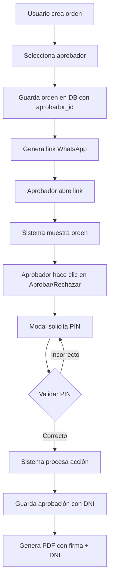

# 🔐 SISTEMA DE APROBACIÓN CON PIN + DNI

## 📋 RESUMEN

Sistema de aprobación inteligente que identifica automáticamente al aprobador desde la orden de compra, requiriendo únicamente validación por PIN para seguridad.

---

## ✅ IMPLEMENTACIÓN COMPLETA

### 1️⃣ **Base de Datos**

#### Nuevos Campos en `ordenes_compra`
```sql
ALTER TABLE ordenes_compra.ordenes_compra
ADD COLUMN aprobador_id INTEGER REFERENCES ordenes_compra.usuarios(id);
```

#### Tabla `usuarios` Extendida
```sql
ALTER TABLE ordenes_compra.usuarios
ADD COLUMN es_aprobador BOOLEAN DEFAULT false,
ADD COLUMN cargo VARCHAR(100),
ADD COLUMN dni VARCHAR(8) UNIQUE,
ADD COLUMN pin_aprobacion VARCHAR(64), -- Hash bcrypt
ADD COLUMN puede_aprobar_sin_limite BOOLEAN DEFAULT false,
ADD COLUMN username VARCHAR(50) UNIQUE;
```

#### Tabla `aprobaciones_ordenes`
```sql
CREATE TABLE ordenes_compra.aprobaciones_ordenes (
  id SERIAL PRIMARY KEY,
  orden_id INTEGER REFERENCES ordenes_compra.ordenes_compra(id),
  usuario_id INTEGER REFERENCES ordenes_compra.usuarios(id),
  nombre_completo VARCHAR(200) NOT NULL,
  cargo VARCHAR(100),
  dni VARCHAR(8) NOT NULL,
  fecha_aprobacion TIMESTAMP DEFAULT CURRENT_TIMESTAMP,
  ip_aprobacion VARCHAR(45),
  metodo_autenticacion VARCHAR(20) DEFAULT 'pin',
  observaciones TEXT,
  CONSTRAINT uk_orden_aprobacion UNIQUE(orden_id)
);
```

---

### 2️⃣ **Backend - Endpoints**

#### **GET /api/aprobacion/aprobadores/listar**
Obtener lista de aprobadores activos.

**Respuesta:**
```json
{
  "success": true,
  "data": [
    {
      "id": 1,
      "nombre_completo": "Juan Colqui Solorzano",
      "cargo": "Presidente",
      "email": "presidente@ladp.pe",
      "puede_aprobar_sin_limite": true
    }
  ]
}
```

#### **POST /api/aprobacion/validar-pin**
Validar PIN del aprobador asignado a la orden.

**Request:**
```json
{
  "token": "abc123...",
  "pin": "1234"
}
```

**Respuesta Éxito:**
```json
{
  "success": true,
  "message": "PIN validado exitosamente",
  "data": {
    "aprobador": {
      "id": 1,
      "nombre_completo": "Juan Colqui Solorzano",
      "cargo": "Presidente",
      "dni": "04081405"
    },
    "orden": {
      "id": 15,
      "numero_oc": "OC-2025-001"
    }
  }
}
```

**Respuesta Error:**
```json
{
  "success": false,
  "error": "PIN_INVALIDO",
  "message": "PIN incorrecto"
}
```

---

### 3️⃣ **Frontend - Flujo de Creación de Orden**

#### **Componente: `InformacionGeneral.jsx`**

1. **Cargar aprobadores disponibles:**
```javascript
const [aprobadores, setAprobadores] = useState([]);

useEffect(() => {
  const cargarAprobadores = async () => {
    const response = await apiService.getAprobadores();
    if (response.success) {
      setAprobadores(response.data);
    }
  };
  cargarAprobadores();
}, []);
```

2. **Selector de aprobador:**
```jsx
<Select
  label="¿Quién debe aprobar esta orden? *"
  value={formData.aprobadorId || ''}
  onChange={(value) => onFormChange('aprobadorId', value)}
  options={[
    { value: '', label: 'Seleccione el aprobador' },
    ...aprobadores.map(aprobador => ({
      value: aprobador.id.toString(),
      label: `${aprobador.nombre_completo} - ${aprobador.cargo}`
    }))
  ]}
  required
/>
```

3. **Validación al crear orden:**
```javascript
if (!formData.aprobadorId) {
  throw new Error('Debe seleccionar quién aprobará esta orden');
}

const ordenData = {
  // ... otros campos
  aprobador_id: parseInt(formData.aprobadorId)
};
```

---

### 4️⃣ **Frontend - Flujo de Aprobación Pública**

#### **Componente: `AprobarOrden.jsx`**

**Flujo:**

1. Usuario abre link de WhatsApp → Sistema muestra orden
2. Usuario hace clic en "Aprobar" o "Rechazar"
3. **Modal solicita PIN** (nuevo)
4. Sistema valida PIN con endpoint `/api/aprobacion/validar-pin`
5. Si PIN es correcto → Ejecuta acción con datos del aprobador

**Código del Modal:**
```jsx
{showPinModal && (
  <div className="fixed inset-0 bg-black bg-opacity-50 flex items-center justify-center z-50">
    <div className="bg-white rounded-lg shadow-xl p-6 max-w-md w-full">
      <h3 className="text-lg font-semibold mb-4">
        🔒 Autenticación Requerida
      </h3>
      
      <input
        type="password"
        value={pin}
        onChange={(e) => setPin(e.target.value.replace(/\D/g, '').slice(0, 4))}
        className="w-full px-4 py-3 border-2 rounded-lg text-center text-2xl tracking-widest font-mono"
        placeholder="••••"
        maxLength={4}
        autoFocus
      />
      
      <button onClick={handleValidarPin}>
        Confirmar
      </button>
    </div>
  </div>
)}
```

**Validación de PIN:**
```javascript
const handleValidarPin = async () => {
  if (!pin || pin.length !== 4) {
    alert('Por favor ingresa tu PIN de 4 dígitos');
    return;
  }

  const response = await apiService.validarPinAprobacion(token, pin);
  
  if (response.success) {
    setAprobadorData(response.data.aprobador);
    setShowPinModal(false);
    await procesarAccion(response.data.aprobador);
  } else {
    alert('PIN incorrecto. Por favor intenta de nuevo.');
  }
};
```

---

### 5️⃣ **Generación de PDF con Datos del Aprobador**

#### **Backend - `routes/pdf.js`**
```sql
SELECT 
  oc.*,
  aprobador.nombre_completo as aprobador_nombre,
  aprobador.cargo as aprobador_cargo,
  aprobador.dni as aprobador_dni
FROM ordenes_compra.ordenes_compra oc
LEFT JOIN ordenes_compra.usuarios aprobador ON oc.aprobador_id = aprobador.id
WHERE oc.id = $1
```

#### **Backend - `services/pdfGenerator.js`**
```javascript
// En la sección de firmas del PDF:
if (ordenData.aprobador_nombre) {
  doc.fontSize(9).font('Helvetica').fillColor('#333333')
     .text(ordenData.aprobador_nombre, 50, y, { align: 'center' });
  doc.fontSize(8).fillColor('#666666')
     .text(ordenData.aprobador_cargo || '', 50, y + 15, { align: 'center' })
     .text(`DNI: ${ordenData.aprobador_dni || 'N/A'}`, 50, y + 28, { align: 'center' });
}
```

---

## 👥 APROBADORES REGISTRADOS

| Nombre                     | Cargo       | DNI      | Usuario  | PIN         |
|----------------------------|-------------|----------|----------|-------------|
| Juan Colqui Solorzano      | Presidente  | 04081405 | jcolqui  | 1234 (temp) |
| Janette Cerna Velazquez    | Secretaria  | (pendiente) | jcerna   | 1234 (temp) |

⚠️ **IMPORTANTE:** Los PINs actuales son temporales. Cambiar en producción.

---

## 🔄 FLUJO COMPLETO



---

## 🔒 SEGURIDAD

### ✅ Implementado
- Hash bcrypt para PINs (costo factor 10)
- Validación de PIN en servidor
- Asociación directa orden → aprobador
- Auditoría con IP, fecha, DNI
- Tokens de 12 horas de expiración
- Single-use tokens

### 📋 Próximas Mejoras
- Registro de intentos fallidos de PIN
- Bloqueo temporal tras 3 intentos fallidos
- Cambio de PIN desde el sistema
- 2FA opcional (SMS/Email)
- Firma digital biométrica

---

## 📝 TESTING

### ✅ Casos de Prueba

1. **Crear Orden sin Aprobador**
   - ❌ Debe fallar con mensaje claro
   
2. **Crear Orden con Aprobador**
   - ✅ Orden guarda `aprobador_id`
   - ✅ Link generado correctamente
   
3. **Aprobar con PIN Correcto**
   - ✅ Modal se cierra
   - ✅ Acción se procesa
   - ✅ Datos del aprobador se guardan
   
4. **Aprobar con PIN Incorrecto**
   - ✅ Mensaje de error
   - ✅ Modal permanece abierto
   - ✅ No se procesa acción
   
5. **PDF Generado**
   - ✅ Incluye nombre del aprobador
   - ✅ Incluye cargo
   - ✅ Incluye DNI
   
6. **Link Expirado**
   - ✅ No permite validar PIN
   - ✅ Mensaje informativo

---

## 🚀 DESPLIEGUE

### Migraciones Ejecutadas
```bash
✅ add-secuencias-oc.sql
✅ add-sistema-aprobacion-pin.sql
✅ add-aprobador-to-ordenes.sql
```

### Scripts de Utilidad
```bash
# Actualizar DNI de aprobadores
node backend/scripts/actualizar-dni-aprobadores.js

# Verificar usuarios aprobadores
SELECT nombre_completo, cargo, dni, es_aprobador 
FROM ordenes_compra.usuarios 
WHERE es_aprobador = true;
```

---

## 📞 CONTACTO PENDIENTE

- [ ] **DNI de Janette Cerna Velazquez** (Secretaria)
- [ ] **PIN de producción para ambos aprobadores**

---

## ✨ VENTAJAS DEL SISTEMA

1. ✅ **Flujo simplificado**: Aprobador solo ingresa PIN (4 dígitos)
2. ✅ **Identificación automática**: Sistema ya sabe quién es el aprobador
3. ✅ **Seguridad**: Validación con hash bcrypt
4. ✅ **Auditoría completa**: Fecha, hora, IP, DNI registrados
5. ✅ **PDF profesional**: Incluye datos del firmante
6. ✅ **Sin límites de monto**: Ambos aprobadores sin restricciones

---

**Implementado por:** Cursor AI Assistant  
**Fecha:** 13 de Octubre, 2025  
**Estado:** ✅ COMPLETADO Y LISTO PARA TESTING

